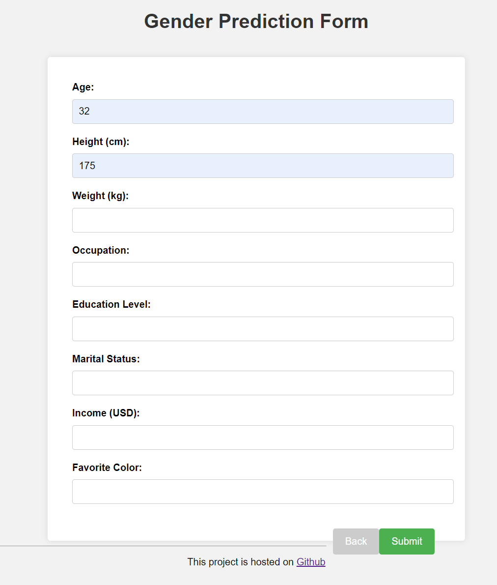
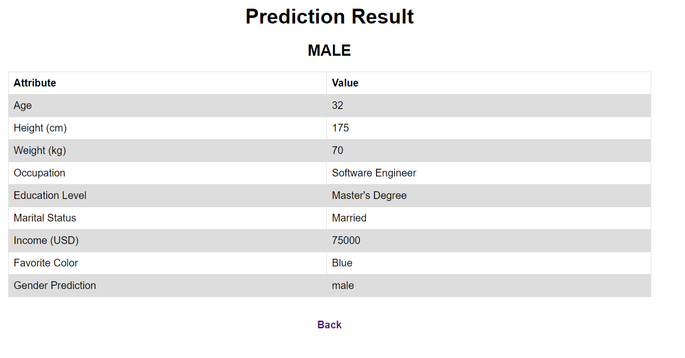

# Gender Prediction

该项目是一个性别预测模型的交互API。

## 如何运行该程序

1. 安装依赖库：

   ```
   pip install -r requirements.txt
   ```

2. 启动程序：

   ```
   python server.py
   ```

   然后在浏览器中打开 http://localhost:5000/ 即可访问。
   
## 如何测试程序

1. 进入Test文件夹

   ```
   cd Test
   ```

2. 启动测试程序:

   ```
   python request.py
   ```

## 文件说明

- `server.py`：程序入口文件，包含Web框架Flask的初始化和路由定义。
- `templates/DataInput.html`：前端页面模板，使用Jinja2模板引擎渲染，用于输入数据
- `templates/DataInput.html`：前端页面模板，用于输出结构
- `static/GenderLogistic.sav`: 提前训练好的，使用逻辑回归的简单模型。
- `Test/request.py`: 测试文件，用于发起一个POST请求用于测试。
- `Test/test_data.csv`: 测试数据。

## API接口说明

### API Predict

#### Description

此API将接收客户端发送的json文件，解析文件中的参数，并使用模型进行预测，最终返回预测结果列表。其中，模型使用labelencoder对输入数据进行预处理，然后进行预测。

#### URL

```
/api/predict
```

#### Method

```
POST
```

#### Parameters

无

#### Request Body

| Name | Type | Required | Description                    |
| ---- | ---- | -------- | ------------------------------ |
| data | JSON | Yes      | The input data in JSON format. |

接受一个json文件，包含以下参数：

- Age（年龄）
- Height (cm)（身高，单位为厘米）
- Weight (kg)（体重，单位为千克）
- Occupation（职业）
- Education Level（教育程度）
- Marital Status（婚姻状况）
- Income (USD)（收入，单位为美元）
- Favorite Color（喜爱的颜色）

#### Example Input

```json
data = {
        # " Gender": gender,
        " Age": 32,
        " Height (cm)": 175,
        " Weight (kg)": 70,
        " Occupation": ' ' + 'Software Engineer',
        " Education Level": ' ' + 'Master\'s Degree',
        " Marital Status": ' ' + 'Married',
        " Income (USD)":75000,
        " Favorite Color": ' ' + 'Blue'
    }
```

#### Example Output

```json
{
  "result": [1]
}
```

#### Response

| Name   | Type | Description                          |
| ------ | ---- | ------------------------------------ |
| result | List | The predicted result in list format. |


## 示例

#### 输入页



#### 输出页



## 参考资料

- Flask官方文档：http://flask.pocoo.org/docs/
- Scikit-learn官方文档：https://scikit-learn.org/stable/documentation.html
